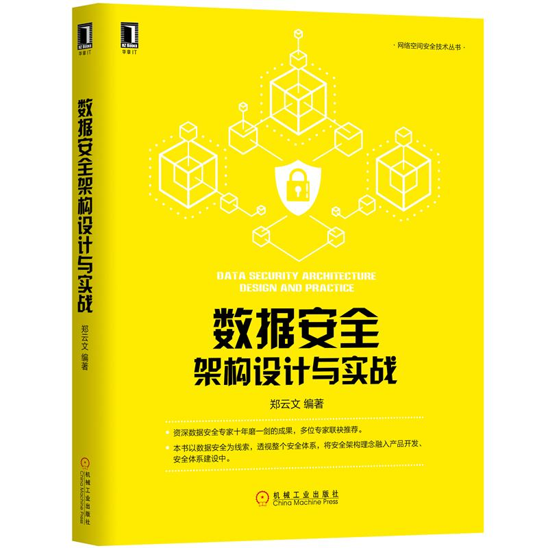

# 数据安全架构设计与实战

《数据安全架构设计与实战》开启预售，预售地址：[北京华章图书天猫专营店](https://detail.tmall.com/item.htm?spm=a230r.1.14.13.70094303eULbfr&id=605489592549&cm_id=140105335569ed55e27b&abbucket=13)   

  

# 赞誉  

数据安全问题其实一直存在，只是在大数据、基于大数据的人工智能时代变得更加重要，郑云文的这本《数据安全架构设计与实战》在覆盖信息安全、网络安全基础知识与最佳实践的基础上，对数据安全相关问题有更深入的探讨。如同书中的观点，安全的系统是设计出来、开发出来的，没有一招见效的“安全银弹”，本书非常适合软件开发型企业的开发主管、信息安全主管与开发工程师阅读，也适合高校信息安全专业的同学作为了解业界网络安全实践的参考书使用。
—— 谭晓生，北京赛博英杰科技有限公司创始人  

数据安全是企业安全建设的重点与难点，大多数企业在数据安全的投入，相对应用安全和内网安全要少很多，但数据安全的重要性却要高很多。少数金融机构设置了专门的数据安全团队，投入大量人财物，未雨绸缪，但多数企业安全建设在数据安全领域还是被动居多，难处在于数据安全缺乏体系性解决方案和安全前置，本书将为读者提供目前急缺的这部分内容，是数据安全领域不错的专业好书。
—— 聂君，奇安信首席安全官  

本书以数据安全实践为基础，结合网络与信息安全相关的理论、技术、方法、案例，系统全面的介绍了数据安全保护技术设计与实现中的知识与实践经验总结，并对数据安全相关的法律、法规、标准等合规性要求进行了梳理，是一本很好的数据安全架构设计与实现的参考书。
—— 王绍斌，亚马逊AWS大中华区首席信息安全官  

本书中的内容系统总结了作者在互联网巨头公司安全部门长期工作最新成果，体系性、实战性及可操作性很强，对安全产业人员非常有参考价值！
—— 蔡一兵，恒安嘉新副总裁  

云文是安全领域的一名老兵，他对于安全的热情和善于总结提炼的特点一直令我印象深刻。随着信息化社会的高速发展，安全问题越来越多的得到大家关注，但安全是一个庞大的系统工程，而数据安全往往是贯穿整个工程的核心焦点，数据安全的难点不仅在于复杂多样的对抗技术，更在于如何工程落地和整合成适配的解决方案，并在业务成长的过程中同样完善发展，这一切都深深的困扰着安全从业者。本书结合在大型互联网企业的工作经验，针对上述难点，系统性讲述数据安全建设方法，并总结出一套保障数据安全的方法论，推荐从事安全工作的朋友们阅读此书。
—— 杨勇（Coolc），腾讯安全平台部负责人，腾讯安全学院副院长  

本书站在企业的角度对安全架构设计给出了详尽的指导，从理论到实现，都沉淀自作者多年的工作实践经验，有着重要参考意义。其对数据安全建设的论述是非常完整的框架，是当前企业接触互联网与大数据后所急需的工作手册。
—— 吴翰清，阿里云首席安全科学家  

如何保障数据安全是目前各行业广泛面临的挑战，而保障好数据安全要涉及基础设施、系统架构、业务应用甚至到生态链条的方方面面，做好做扎实尤其不易。郑云文的这本书非常契合当前行业的需求，特别对于数据安全保障的关键环节有着翔实的实践经验分析和介绍，能够给安全从业者良好的借鉴。
—— 韦韬（Lenx），百度首席安全科学家，北大客座教授  

市面上的书在企业安全领域分散的知识点很多，系统性的方法比较少，讲攻防的居多，讲数据安全的极少。企业安全，信息安全本质还是要保护数据安全，但数据安全的问题大部分不是因为攻防对抗的缺漏引起的，而是发生在整个企业价值链和全生命周期，甚至在泛生态，产业链上也有衍生问题。对于这些问题的解决不能只靠单点技术对抗，而是需要有贯穿全局的视野和系统性风险防范，本书是难得的系统性讲述数据安全建设方法的书，对于广大安全从业者是不可多得的必备读物，对于从事安全数据分析（态势感知）的同学可以增加态势的全局能力，对SDL的同学可以提升安全设计能力，对应急响应的同学可以提升数据视角应急和溯源的能力，对红蓝对抗的攻方和防守方以及业务安全的风控都能补全数据视角下需要的闭环运营工作的视野，强烈推荐。
—— 赵彦（ayazero)，美团点评 集团安全部总经理  

如今已进入“数据为王”的时代，谁掌握了数据，谁就拥有了最宝贵的资源和最强大的业务潜能，同时必然面临着重大的安全威胁与责任。
业务系统快速迭代、攻防博弈不断升级、数据安全治理政策逐渐出台合并产生的压力与日俱增，本书针对数据安全保护这一核心问题，从安全架构基础、产品安全架构、安全技术体系架构、数据安全与隐私保护治理等多个角度进行了全面探讨和循序渐进的系统化梳理，并给出了在各阶段保障数据安全的有效解决思路和业界最佳实践，有利于帮助读者快速了解数据安全的全貌，构建数据安全技术体系以及架构性思维模式，有助于相关单位从系统设计阶段就开始系统规划和引入安全策略、部署安全技术，并遵循数据安全治理要求，防患于未然。
本书适合信息系统设计、开发和运维人员，以及安全从业人员，同时也非常适合网络空间安全与计算机学科的在校大学生。
—— 彭国军，武汉大学国家网络安全学院教授  

这是围绕数据安全来考虑安全架构设计的一本书，作者从认证授权和数据资产保护的角度，对安全防御体系做出了诠释，将多年工作经验沉淀其中，值得一读。
—— 董志强，腾讯安全云鼎实验室负责人  

随着互联网时代的发展，数据已经逐渐成为企业的核心资产，对数据资产的保护成为新的课题。本书脱离传统的网络安全视角，以数据安全为中心展开讨论，在数据生命周期的各个流转阶段引入安全措施，观点新颖，书中既有丰富的理论知识也有最佳实践，是一本不错的信息安全专业书籍。推荐。
—— 胡珀（lake2），资深网络安全专家、腾讯安全平台部总监  

随着欧盟《通用数据保护条例GDPR》生效和各国监管法案的出台，数据安全和隐私保护已经成为企业安全建设的关注点。数据安全可以归类为信息安全或网络安全众多安全领域中的一个，也可以视为与信息安全和网络安全并驾齐驱的独立安全体系。数据安全在信息安全CIA三性基础上增加了数据主体的权利，如何平衡数据价值的合规利用和有效保护需要数据安全的方法论和最佳实践，以便企业在实践中借鉴和落地。
郑云文的《数据安全架构设计与实践》不仅包括数据保护的方法论和框架，同时对数据安全和隐私保护的核心技术做了详细阐述；本书不仅适合产品经理、开发工程师理解数据安全的方法论，同时适合安全合规人员、律师了解相关技术措施在隐私保护上起到的作用。
—— 宋文宽，小米安全与隐私合规总监  

数据安全是安全工程建设和运营的重要结果。本书围绕数据安全，从技术、管理、合规等维度，与读者分享相关思考、方法论和实践，是该领域不可多得的一本好书。
—— 方勇，腾讯云安全首席架构师  

数据安全是安全线人员和业务线人员为数不多的都可以理解的领域，业务线的人员很可能不懂SQL注入，也很可能不懂Webshell，但是业务线的人员可以理解业务数据库中数据的价值以及丢失后对公司的损失。数据安全从广义来理解，技术视角是数据安全，2C视角是个人隐私，都是目前安全领域的热门话题，相关的大部头文章其实很多，各种规范也层出不穷，但是如何落地到业务中呢？本书作者有着多年安全领域的从业经历，既有互联网公司，也有运营商和传统制造领域，作者把自己对数据安全的理解和实践，浓缩在本书的20章中，强烈推荐安全从业人员研读本书。
—— 兜哥，百度安全资深研究员，《企业安全建设入门:基于开源软件打造企业网络安全》作者  

很高兴能看到《数据安全架构设计与实战》成文出版，这本书内容丰富翔实，令人赞叹。曾经和郑兄在同一互联网巨头公司的安全平台部门共事过两年，打开这本书我又回想起了那些一起对抗黑产入侵、一起推动数据保护项目的日子。数据资产是互联网企业的核心资产，关系到企业的生命线。作为多年奋战数据安全保护展现的一名互联网安全老兵，郑兄从实战出发很好的总结了数据安全体系的建设思路，将实践中的经验教训升级为朴实的方法论，非常具有借鉴价值。
—— 马传雷（ Flyh4t），同盾科技反欺诈研究院负责人  

我曾经跟郑云文共同工作过一段时间。在数据安全团队的职责上，不同的公司目前还是有一些区别的。普遍认为数据安全其实很难独立于传统的基础安全/应用运维安全而存在，因此，站在保护数据的视角来看，传统的很多做法本质是为了保护公司的信息资产——数据。书中既有站在甲方安全运营视角下的传统建设思路和释疑，又有站在数据视角的方法论介绍和实战经验。因此，此书的架构、内容，其实非常适合那些想要对数据进行保护，却不知道如何下手的企业和工程师，也很适合学生时期计划投身于安全视野的新人。
—— 赵弼政（职业欠钱），美团基础安全负责人  

# 简介  

资深数据安全专家十年磨一剑的成果，多位专家联袂推荐。  
本书以数据安全为线索，透视整个安全体系，将安全架构理念融入产品开发、安全体系建设中。  

本书系统性地介绍数据安全架构的设计与实践，融入了作者多年在安全领域积累的实践经验。全书分四大部分，共20章。  
第一部分介绍安全架构的基础知识，内容包括安全、数据安全、安全架构、5A方法论、CIA等基本概念,为后续论述奠定基础。  
第二部分介绍产品安全架构，内容包括：身份认证、授权、访问控制、审计、资产保护等，讲解如何从源头设计来保障数据安全和隐私安全，防患于未然。  
第三部分介绍安全技术体系架构，内容包括：安全技术架构、网络和通信层安全架构、设备和主机层安全架构、应用和数据层安全架构、安全架构案例分析等。  
第四部分介绍数据安全与隐私保护治理，内容包括：数据安全治理、数据安全政策文件体系、隐私保护基础与增强技术、GRC治理框架、数据安全与隐私保护的统一等。 

# 前言

你一定听说过非常厉害的黑客，各种奇技淫巧，分分钟拖走大量数据！或入侵到目标内网，Get Shell、提升权限、拖走数据库！抑或根本不用进入内网，直接远程操作一番，就能窃取到大量数据，犹如探囊取物一般容易。  
可是，站在黑客的对立面，作为防御的一方，公司频频遭遇入侵、网络攻击或数据泄露事件，一方面会面临巨大的业务损失，另一方面也会面临来自用户、媒体、监管层面的重重压力。  
数据安全是一个非常严峻的问题。数据泄露事件层出不穷，就算是安全建设得比较好的企业，也不能保证自己不出问题，况且在日常安全工作中，还面临着三大困境—资源有限、时间不够、能力不足，使得我们距离数据安全的目标还有不小的差距。  
“资源有限”体现在企业在安全方面的投入往往不足，特别是在预防性安全建设、从源头开始安全建设的投入方面，更加缺乏。在有的产品团队，人力几乎全部投在业务方面，没有人对安全负责，产品发布上线后，也缺乏统一的安全增强基础设施（例如在统一的接入网关上实施强制身份认证），导致产品基本没有安全性可言。  
“时间不够”是因为业务开发忙得不可开交，完成业务功能的时间都不够，哪里还有时间考虑安全呢？这也是为什么我们经常会发现有的JSON API接口根本就没有身份认证、授权、访问控制等机制，只要请求过来就返回数据。  
“能力不足”体现在具备良好安全设计能力和良好开发能力的人员太少，基层开发人员普遍缺乏良好的安全实践和意识，写出来的应用频频出现高危漏洞。就算能够事先意识到安全问题，在实现上，安全解决方案也是五花八门，重复造轮子，且互不通用，往往问题多多，效率低下；就算发现了安全问题，然而牵一发而动全身，修改了问题还担心业务服务是否正常运转。  
在几大困境面前，各产品团队往往寄希望于企业内安全团队的事后防御。殊不知，事后解决问题，也有诸多局限：
时间不等人，险情就是命令！当漏洞或事件报告过来的时候，无论是节假日，还是半夜时分，都需要立即启动应急响应，“三更起四更眠”屡见不鲜。数量不多时还可以承受，但长此以往，负责应急的同学身体也吃不消，需要不断招聘新人及启用岗位轮换机制。  
依赖各种安全防御系统，没有从根本上解决问题，属于治标不治本，黑客经常能找到绕过安全防御系统的方法，就如同羸弱的身体失去了铠甲的保护。  
事后修复很可能会影响业务连续性，即便产品团队已经知道问题出在哪里了，但是由于业务不能停，风险迟迟得不到修复，因此还可能引发更大的问题。  
安全不是喊口号就能做好的。实际上，安全是一项系统性工程，需要方法论的指导，也需要实践的参考。  
我们如何才能克服上述三大困境，更好地保护业务，防止数据泄露呢？本书尝试通过一套组合拳逐一化解：  
通过安全架构方法论的引入，探讨如何从源头开始设计产品自身的安全架构，快速提升产品自身的安全能力，让产品（网络服务等）天然就具有免疫力，构建安全能力的第一道防线。  
梳理安全技术体系架构，建立并完善安全领域的基础设施及各种支撑系统，让产品与安全基础设施分工协作，并对协作进行疏导（即“哪些应该交给产品自身来实现，哪些交给安全基础设施进行落地”），减少各业务在安全上的重复性建设和资源投入，避免重复造轮子，让业务聚焦到业务上去，节省业务团队在安全方面投入的时间。产品外部的安全能力，构成了第二道防线。  
以数据安全的视角，一览企业数据安全治理的全貌，协助提升大家的架构性思维，站在全局看问题，了解数据安全与隐私保护治理实践。  
总的来说，这是一本有关数据安全架构的技术性书籍，但也会涉猎数据安全治理的内容，目的在于让大家了解数据安全的全局，培养架构性思维模式，希望能给企业安全建设团队或有志于从事安全体系建设的读者一些建设性的参考。  

## 内容简介  
随着数据时代的到来，安全体系架构逐步由之前的“以网络为中心”（称之为网络安全）过渡到“以数据为中心”（称之为数据安全）。本书将使用数据安全这一概念，并以数据的安全收集或生成、安全使用、安全传输、安全存储、安全披露、安全流转与跟踪、安全销毁为目标，透视整个安全体系，进而将安全架构理念融入产品开发过程、安全技术体系及流程体系中，更好地为企业的安全目标服务。  
我们将站在黑客的对立面，以防御的视角，系统性地介绍安全架构实践，共包含四个部分。  
第一部分为安全架构的基础知识，为后续章节打好基础。  

第二部分为产品安全架构，从源头开始设计产品自身的安全架构，提升产品的安全能力，内容包括：  
* 安全架构5A方法论（即安全架构的5个核心要素，身份认证、授权、访问控制、审计、资产保护）。  
* 产品（或应用系统）如何从源头设计数据安全（Security by Design）和隐私安全（Privacy by Design）的保障体系，防患于未然。  

第三部分为安全技术体系架构，通过构建各种安全基础设施，增强产品的安全能力，内容包括：  
* 建立和完善安全技术体系（包括安全防御基础设施、安全运维基础设施、安全工具与技术、安全组件与支持系统）。  
* 安全架构设计的最佳实践案例。  

第四部分为数据安全与隐私保护领域的体系化介绍，供读者了解数据安全与隐私保护的治理实践，内容包括：  
* 数据安全治理，包括如何设定战略，组织、建立数据安全文件体系，以及安全运营、合规与风险管理实践等。  
* 隐私保护治理，包括隐私保护基础、隐私保护技术、隐私保护治理实践等。

本书使用的源代码发布在[https://github.com/zhyale/book1](https://github.com/zhyale/book1) ，欢迎读者在此提交问题或反馈意见。

## 安全理念  
本书将使用如下安全理念：  
* “主动预防”胜于“事后补救”。
* 默认就需要安全，安全贯穿并融入产品的生命周期，尽可能地从源头改善安全（架构设计、开发、部署配置）；对数据的保护，也不再是保护静态存储的数据，而是全生命周期的数据安全与隐私保护（包括数据的安全收集或生成、安全使用、安全传输、安全存储、安全披露、安全流转与跟踪、安全销毁等）；在安全设计上，不依赖于广大员工的自觉性，而是尽量让大家不犯错误。
* 数据安全与隐私保护可以和业务双赢，数据安全与隐私保护不是妨碍业务的绊脚石，也可以成为助力业务腾飞的核心竞争力。只有真正从用户的立场出发，充分重视数据安全，尊重用户隐私，才能赢得市场的尊重。  

在安全架构实践中，我们将采用基于身份的信任思维：默认不信任企业内部和外部的任何人、设备、系统，需基于身份认证和授权，执行以身份为中心的访问控制和资产保护。在涉及算法或理论细节时，我们将基于工程化及建设性思维：不纠缠产品或技术的理论细节，只考虑是否属于业界最佳实践，是否可以更好地用于安全建设，做建设性安全。  

## 读者对象
本书主要面向安全领域的从业者、爱好者，特别是：
网络安全、数据安全从业人员；
希望提升产品安全性的应用开发人员；
各领域架构师；
有意进入安全行业、隐私保护行业的爱好者、学生。
## 致谢  
感谢我所任职过的公司，在工作中让我有了练兵、成长、积累的机会，也感谢各位领导、同事、安全圈同行与各位朋友的帮助，他们包括但不限于：谭晓生@赛博英杰、李雨航@CSA、聂君（君哥的体历）@奇安信、王绍斌@亚马逊、蔡一兵@恒安嘉新、杨勇（coolc）@腾讯、赵彦（ayazero）@美团、吴翰清@阿里巴巴、韦韬（Lenx）@百度、彭国军@WHU、董志强（killer）@腾讯、胡珀（lake2）@腾讯、郑斌（天明）@阿里巴巴、宋文宽@小米、方勇（包子）@腾讯、刘焱（兜哥）@百度、赵弼政（职业欠钱）@美团、马传雷（Flyh4t）@同盾、王珂、郑兴（sim）@腾讯、刘宁@腾讯、郭铁涛@腾讯、胡享梅（梅子）@腾讯（排名不分先后）以及一大批曾经一起奋战过的同事们。  
感谢云安全联盟CSA大中华区主席、中国科学院云安全首席科学家李雨航为本书作序。  
感谢资深网络安全专家、腾讯安全平台部总监胡珀为本书作序。  
感谢编辑吴怡，为本书提出大量改进意见和建设性建议。  
感谢机械工业出版社的各位编辑、排版、设计人员。  
感谢我的家人，是你们的支持，我才得以完成此书。  

# 目录  
对本书的赞誉  
序 一  
序 二  
前 言  

第一部分 安全架构基础  
第1章 架构  
1.1 什么是架构  
1.2 架构关注的问题  
第2章 安全架构  
2.1 什么是安全  
2.2 为什么使用“数据安全”这个术语  
2.3 什么是安全架构  
2.4 安全架构5A方法论  
2.5 安全架构5A与CIA的关系  

第二部分 产品安全架构  
第3章 产品安全架构简介  
3.1 产品安全架构  
3.2 典型的产品架构与框架  
3.2.1 三层架构  
3.2.2 B/S架构  
3.2.3 C/S架构  
3.2.4 SOA及微服务架构  
3.2.5 典型的框架  
3.3 数据访问层的实现  
3.3.1 自定义DAL  
3.3.2 使用ORM  
3.3.3 使用DB Proxy  
3.3.4 配合统一的数据服务简化DAL  
第4章 身份认证：把好第一道门  
4.1 什么是身份认证  
4.2 如何对用户进行身份认证  
4.2.1 会话机制  
4.2.2 持续的消息认证机制  
4.2.3 不同应用的登录状态与超时管理  
4.2.4 SSO的典型误区  
4.3 口令面临的风险及保护  
4.3.1 口令的保护  
4.3.2 口令强度  
4.4 前端慢速加盐散列案例  
4.5 指纹、声纹、虹膜、面部识别的数据保护  
4.6 MD5、SHA1还能用于口令保护吗  
4.6.1 单向散列算法简介  
4.6.2 Hash算法的选用  
4.6.3 存量加盐HASH的安全性  
4.7 后台身份认证  
4.7.1 基于用户Ticket的后台身份认证  
4.7.2 基于AppKey的后台身份认证  
4.7.3 基于非对称加密技术的后台身份认证  
4.7.4 基于HMAC的后台身份认证  
4.7.5 基于AES-GCM共享密钥的后台身份认证  
4.8 双因子认证  
4.8.1 手机短信验证码  
4.8.2 TOTP  
4.8.3 U2F  
4.9 扫码认证  
4.10 小结与思考  
第5章 授权：执掌大权的司令部  
5.1 授权不严漏洞简介  
5.2 授权的原则与方式  
5.2.1 基于属性的授权  
5.2.2 基于角色的授权  
5.2.3 基于任务的授权  
5.2.4 基于ACL的授权  
5.2.5 动态授权  
5.3 典型的授权风险  
5.3.1 平行越权  
5.3.2 垂直越权  
5.3.3 诱导授权  
5.3.4 职责未分离  
5.4 授权漏洞的发现与改进  
5.4.1 交叉测试法  
5.4.2 漏洞改进  
第6章 访问控制：收敛与放行的执行官  
6.1 典型的访问控制策略  
6.1.1 基于属性的访问控制  
6.1.2 基于角色的访问控制  
6.1.3 基于任务的访问控制  
6.1.4 基于ACL的访问控制  
6.1.5 基于专家知识的访问控制  
6.1.6 基于IP的辅助访问控制  
6.1.7 访问控制与授权的关系  
6.2 不信任原则与输入参数的访问控制  
6.2.1 基于身份的信任原则  
6.2.2 执行边界检查防止缓冲区溢出  
6.2.3 参数化查询防止SQL注入漏洞  
6.2.4 内容转义及CSP防跨站脚本  
6.2.5 防跨站请求伪造  
6.2.6 防跨目录路径操纵  
6.2.7 防SSRF  
6.2.8 上传控制  
6.2.9 Method控制  
6.3 防止遍历查询  
第7章 可审计：事件追溯最后一环  
7.1 为什么需要可审计  
7.2 操作日志内容  
7.3 操作日志的保存与清理  
7.3.1 日志存储位置  
7.3.2 日志的保存期限  
第8章 资产保护：数据或资源的贴身保镖  
8.1 数据安全存储  
8.1.1 什么是存储加密  
8.1.2 数据存储需要加密吗  
8.1.3 加密后如何检索  
8.1.4 如何加密结构化数据  
8.2 数据安全传输  
8.2.1 选择什么样的HTTPS证书  
8.2.2 HTTPS的部署  
8.2.3 TLS质量与合规  
8.3 数据展示与脱敏  
8.3.1 不脱敏的风险在哪里  
8.3.2 脱敏的标准  
8.3.3 脱敏在什么时候进行  
8.3.4 业务需要使用明文信息怎么办  
8.4 数据完整性校验  
第9章 业务安全：让产品自我免疫  
9.1 一分钱漏洞  
9.2 账号安全  
9.2.1 防撞库设计  
9.2.2 防弱口令尝试  
9.2.3 防账号数据库泄露  
9.2.4 防垃圾账号  
9.2.5 防账号找回逻辑缺陷  
9.3 B2B交易安全  
9.4 产品防攻击能力  

第三部分 安全技术体系架构  
第10章 安全技术体系架构简介  
10.1 安全技术体系架构的建设性思维  
10.2 安全产品和技术的演化  
10.2.1 安全产品的“老三样”  
10.2.2 网络层延伸  
10.2.3 主机层延伸  
10.2.4 应用层延伸  
10.2.5 安全新技术  
10.3 安全技术体系架构的二维模型  
10.4 风险管理的“三道防线”  
10.5 安全技术体系强化产品安全  
10.5.1 网络部署架构  
10.5.2 主机层安全  
10.5.3 应用层安全  
10.5.4 数据层安全  
第11章 网络和通信层安全架构  
11.1 简介  
11.2 网络安全域  
11.2.1 最简单的网络安全域  
11.2.2 最简单的网络安全域改进  
11.2.3 推荐的网络安全域  
11.2.4 从有边界网络到无边界网络  
11.2.5 网络安全域小结  
11.3 网络接入身份认证  
11.4 网络接入授权  
11.5 网络层访问控制  
11.5.1 网络准入控制  
11.5.2 生产网络主动连接外网的访问控制  
11.5.3 网络防火墙的管理  
11.5.4 内部网络值得信任吗  
11.5.5 运维通道的访问控制  
11.6 网络层流量审计  
11.7 网络层资产保护：DDoS缓解  
11.7.1 DDoS简介  
11.7.2 DDoS缓解措施  
11.7.3 专业抗DDoS方案  
第12章 设备和主机层安全架构  
12.1 简介  
12.2 身份认证与账号安全  
12.2.1 设备/主机身份认证的主要风险  
12.2.2 动态口令  
12.2.3 一次一密认证方案  
12.2.4 私有协议后台认证方案  
12.3 授权与访问控制  
12.3.1 主机授权与账号的访问控制  
12.3.2 主机服务监听地址  
12.3.3 跳板机与登录来源控制  
12.3.4 自动化运维  
12.3.5 云端运维  
12.3.6 数据传输  
12.3.7 设备的访问控制  
12.4 运维审计与主机资产保护  
12.4.1 打补丁与防病毒软件  
12.4.2 母盘镜像与容器镜像  
12.4.3 开源镜像与软件供应链攻击防范  
12.4.4 基于主机的入侵检测系统  
第13章 应用和数据层安全架构  
13.1 简介  
13.2 三层架构实践  
13.2.1 B/S架构  
13.2.2 C/S架构  
13.3 应用和数据层身份认证  
13.3.1 SSO身份认证系统  
13.3.2 业务系统的身份认证  
13.3.3 存储系统的身份认证  
13.3.4 登录状态管理与超时管理  
13.4 应用和数据层的授权管理  
13.4.1 权限管理系统  
13.4.2 权限管理系统的局限性  
13.5 应用和数据层的访问控制  
13.5.1 统一的应用网关接入  
13.5.2 数据库实例的安全访问原则  
13.6 统一的日志管理平台  
13.7 应用和数据层的资产保护  
13.7.1 KMS与存储加密  
13.7.2 应用网关与HTTPS  
13.7.3 WAF（Web应用防火墙）  
13.7.4 CC攻击防御  
13.7.5 RASP  
13.7.6 业务风险控制  
13.8 客户端数据安全  
13.8.1 客户端敏感数据保护  
13.8.2 安全传输与防劫持  
13.8.3 客户端发布  
第14章 安全架构案例与实战  
14.1 零信任与无边界网络架构  
14.1.1 无边界网络概述  
14.1.2 对人的身份认证（SSO及U2F）  
14.1.3 对设备的身份认证  
14.1.4 最小授权原则  
14.1.5 设备准入控制  
14.1.6 应用访问控制  
14.1.7 借鉴与改进  
14.2 统一HTTPS接入与安全防御  
14.2.1 原理与架构  
14.2.2 应用网关与HTTPS  
14.2.3 WAF与CC防御  
14.2.4 私钥数据保护  
14.2.5 负载均衡  
14.2.6 编码实现  
14.2.7 典型特点  
14.3 存储加密实践  
14.3.1 数据库字段加密  
14.3.2 数据库透明加密  
14.3.3 网盘文件加密方案探讨  
14.3.4 配置文件口令加密  
14.4 最佳实践小结  
14.4.1 统一接入  
14.4.2 收缩防火墙的使用  
14.4.3 数据服务  
14.4.4 建立KMS  
14.4.5 全站HTTPS  
14.4.6 通用组件作为基础设施  
14.4.7 自动化运维  

第四部分 数据安全与隐私保护治理  
第15章 数据安全治理  
15.1 治理简介  
15.1.1 治理与管理的区别  
15.1.2 治理三要素  
15.2 数据安全治理简介  
15.2.1 数据安全治理的要素  
15.2.2 数据安全治理与数据安全管理的关系  
15.3 安全项目管理  
15.4 安全运营管理  
15.5 合规与风险管理  
15.6 安全开发生命周期管理（SDL）  
15.6.1 SQL注入漏洞案例  
15.6.2 SDL关键检查点与检查项  
15.6.3 SDL核心工作  
15.7 风险管理  
15.7.1 风险识别或评估  
15.7.2 风险度量或成熟度分析  
15.7.3 风险处置与收敛跟踪  
15.7.4 风险运营工具和技术  
15.8 PDCA方法论与数据安全治理  
第16章 数据安全政策文件体系  
16.1 数据安全文件体系  
16.1.1 四层文件体系架构简介  
16.1.2 数据安全四层文件体系  
16.1.3 标准、规范与管理规定的关系  
16.1.4 外部法规转为内部文件  
16.2 数据安全政策总纲  
16.2.1 数据安全的目标和范围  
16.2.2 数据安全组织与职责  
16.2.3 授权原则  
16.2.4 数据保护原则  
16.2.5 数据安全外部合规要求  
16.3 数据安全管理政策  
16.3.1 数据分级与分类  
16.3.2 风险评估与定级指南  
16.3.3 风险管理要求  
16.3.4 事件管理要求  
16.3.5 人员管理要求  
16.3.6 配置和运维管理  
16.3.7 业务连续性管理  
16.4 数据安全标准  
16.4.1 算法与协议标准  
16.4.2 口令标准  
16.4.3 产品与组件标准  
16.4.4 数据脱敏标准  
16.4.5 漏洞定级标准  
16.5 数据安全技术规范  
16.5.1 安全架构设计规范  
16.5.2 安全开发规范  
16.5.3 安全运维规范  
16.5.4 安全配置规范  
16.6 外部合规认证与测评  
第17章 隐私保护基础  
17.1 隐私保护简介  
17.1.1 典型案例  
17.1.2 什么是隐私  
17.1.3 隐私保护与数据安全的关系  
17.1.4 我需要了解隐私保护吗  
17.1.5 隐私保护的技术手段  
17.1.6 合规遵从  
17.2 GDPR  
17.2.1 简介  
17.2.2 两种角色  
17.2.3 六项原则及问责制  
17.2.4 处理个人数据的六个法律依据  
17.2.5 处理儿童数据  
17.2.6 特殊的数据类型  
17.2.7 数据主体的权利  
17.2.8 数据控制者和数据处理者的义务  
17.2.9 违规与处罚  
17.3 个人信息安全规范  
17.3.1 简介  
17.3.2 个人信息安全原则  
17.3.3 个人信息的生命周期管理  
17.4 GAPP框架  
17.5 ISO 27018  
第18章 隐私保护增强技术  
18.1 隐私保护技术初探  
18.2 去标识化  
18.2.1 匿名化  
18.2.2 假名化  
18.2.3 K-匿名  
18.3 差分隐私  
18.3.1 差分隐私原理  
18.3.2 差分隐私噪声添加机制  
18.3.3 数值型差分隐私  
18.3.4 数值型差分隐私的局限性  
18.3.5 离散型差分隐私  
18.3.6 差分隐私案例  
18.3.7 差分隐私实战  
第19章 GRC与隐私保护治理  
19.1 风险  
19.2 GRC简介  
19.2.1 GRC三领域  
19.2.2 GRC控制模型  
19.3 隐私保护治理简介  
19.4 隐私保护治理GRC实践  
19.4.1 计划  
19.4.2 执行  
19.4.3 检查  
19.4.4 处理  
19.5 隐私保护能力成熟度  
第20章 数据安全与隐私保护的统一  
20.1 以数据为中心的统一治理  
20.1.1 统一的数据安全治理  
20.1.2 统一数据目录与数据流图  
20.1.3 统一数据服务  
20.2 统一的数据安全生命周期管理  
20.2.1 数据安全生命周期  
20.2.2 全生命周期的数据主体权利保障  
20.2.3 典型案例  
20.3 数据安全治理能力成熟度模型（DSGMM）  
附录 数据安全架构与治理总结  
参考文献  

# 读者交流  
QQ群：879622682 （数据安全交流）  
  

微信公众号：数据安全架构与治理（Data-Security）   
   

